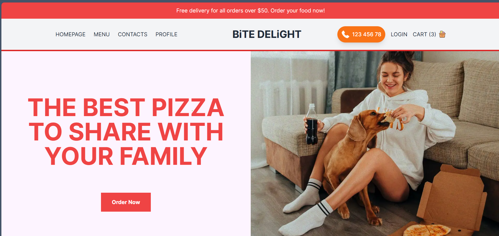
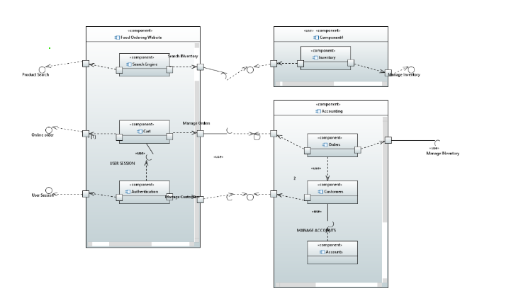
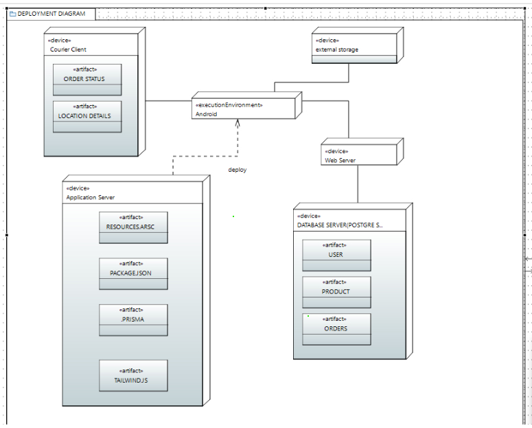

## HomePage


# Restaurant Food Ordering App

Welcome to the Restaurant Food Ordering App, a comprehensive solution designed to streamline the online food ordering experience for customers and optimize inventory management for restaurant administrators. This project is developed as part of the Software Engineering course at the National University of Computer and Emerging Sciences, Karachi Campus.

## Introduction

In today's fast-paced world, the convenience of online ordering has become paramount. Our system is designed to meet the evolving needs of both customers and restaurant administrators. Through our user-friendly website, customers can browse a wide selection of delectable dishes, place orders effortlessly, and complete secure payments—all from the comfort of their homes. Meanwhile, restaurant administrators benefit from powerful tools for inventory management, allowing them to add new menu items, delete outdated dishes, and maintain a comprehensive overview of stock levels.

## Motivation

Our project, the Restaurant Management System (RMS), is driven by the need to improve the handling of food orders and inventory in restaurants. Our goals include:
- Creating a user-friendly system for food ordering
- Ensuring security in payments
- Enabling restaurant staff to view customers' food order records

## Assumptions and Dependencies

### Assumptions
- Customers have access to the internet and can use the website to place orders.
- Restaurant staff are trained to use the RMS for processing orders.

### Dependencies
- Availability of internet connectivity for both customers and restaurant staff.
- Access to accurate and up-to-date inventory information from suppliers.

## Functional Requirements

1. **User Registration and Login**: Customers can create accounts and log in to place orders and view order history. Secure authentication ensures user privacy.
2. **Menu Browsing and Selection**: A user-friendly interface allows customers to browse the restaurant’s menu, view food items, and select dishes they wish to order.
3. **Order Placement**: Customers can add selected food items to their cart and specify quantities. The order placement process is secure.
4. **Payment Processing**: Multiple payment methods are available for customer convenience.
5. **Customized Dishes**: Customers can provide preferences (e.g., spice level, dietary restrictions), and staff will prepare meals accordingly.
6. **Discounts, Special Offers, and Packages**: Customers can avail special deals and discounts, enhancing customer loyalty.
7. **Order Status Updates**: Staff can view order status (processing, out for delivery, delivered), with real-time notifications for customers.
8. **Contact Details**: Customers can easily reach out to restaurant management for queries or complaints.
9. **Receipt Preview**: Customers can review payment details before placing an order.
10. **Cart Transactions**: Customers can add multiple items to the cart and remove them as needed.
11. **Add Products**: Administrators can add items to the menu along with descriptions and prices.
12. **Digital Payment**: Multiple payment options are available, including credit card and cash on delivery.

## Non-Functional Requirements

1. **Performance**: The system should be responsive and handle multiple concurrent users without significant slowdowns or delays.
2. **Reliability**: The system should be always reliable and available for use, minimizing downtime and service disruptions.
3. **Security**: The system should ensure the security and confidentiality of user data, including personal information and payment details.
4. **Usability**: The system should be intuitive and easy to use for both customers and restaurant staff, requiring minimal training.

## Constraints

1. **Technical Limitations**: Limited availability of certain technologies or programming languages may restrict the implementation of specific features or functionalities.
2. **Time Constraints**: The project may be subject to deadlines or timeframes that restrict the amount of time available for development and testing phases.
3. **Resource Constraints**: Limited availability of human resources, such as developers, testers, or project managers, may impact the project's progress and execution.

## Architecture Design

The Restaurant Management System (RMS) architecture consists of four main components: the Client Interface, Server-Side Application, and Database. Customers interact with the Client Interface to place orders and track them. The Server-Side Application processes these orders, handles payments, and updates inventory, communicating with the Database to store and retrieve data. These components interact seamlessly to provide a smooth and reliable ordering experience for customers while enabling efficient management of restaurant operations.

### Deployment Diagram


### Component Diagram


## Installation

To get a local copy up and running, follow these steps:

1. **Clone the repository**
    ```bash
    git clone https://github.com/yourusername/restaurant-food-ordering-app.git
    ```
2. **Navigate to the project directory**
    ```bash
    cd restaurant-food-ordering-app
    ```
3. **Manage the database with Prisma Studio**
    ```bash
    npx prisma studio
    ```
4. **Start the development server**
    ```bash
    npm run dev
    ```

## Team Members

- **Insha Javed** - [GitHub](https://github.com/insha-javed)
- **Muhammad Tahir** - [GitHub](https://github.com/muhammad-tahir)
---
